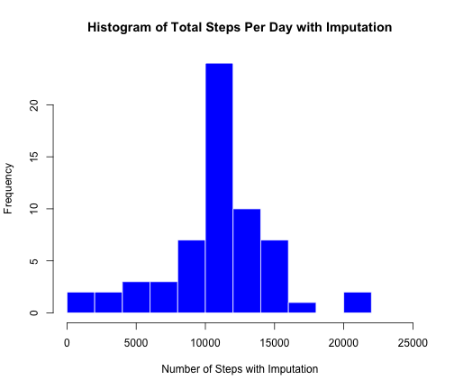

Reproducible Research Assignment 1
========================================================
*by R. Bagnall*

This assignment makes use of data from a personal activity monitoring device. This device collects data at 5 minute intervals through out the day. The data consists of two months of data from an anonymous individual collected during the months of October and November, 2012 and include the number of step taken in 5 minute intervals each day.

### 1. Loading and processing the data

The data for this assignment can be downloaded from the course website:
#### Dataset: [Activity monitoring data](https://d396qusza40orc.cloudfront.net/repdata%2Fdata%2Factivity.zip) [52K]

The variables included in this dataset are:  

* __steps__: Number of steps taking in a 5-minute interval (missing values are coded as ```(NA)```
* __date__: The date on which the measurement was taken in YYYY-MM-DD format 
* __interval__: Identifier for the 5-minute interval in which measurement was taken

The dataset is stored in a comma-separated-value (CSV) file and there are a total of 17,568 observation in this dataset.

Read in the dataset and call it __df__; show the first few columns.

```r
df <- read.csv("activity.csv", header=TRUE)

head(df)
```

```
##   steps       date interval
## 1    NA 2012-10-01        0
## 2    NA 2012-10-01        5
## 3    NA 2012-10-01       10
## 4    NA 2012-10-01       15
## 5    NA 2012-10-01       20
## 6    NA 2012-10-01       25
```

### 2. What is the mean total number of steps taken per day?

Ignoring the missing values, split __df__ on the date and calculate the total number of steps taken per day. Make a histogram of the total number of steps taken each day. I used `breaks=15` to show smaller divisions of the data.


```r
# calculate total number of steps taken per day
StepsPerDay <- as.data.frame(sapply(split(df, df[2], drop=TRUE), function(x) {sum(x$steps)}))

# make histrogram of total steps taken per day
hist(as.numeric(StepsPerDay[,1]), main="Histogram of Total Steps Taken Each Day", xlab="Total Number of Steps", ylab="Frequency", breaks=15, border="red", xlim=c(0,25000))
```

 


```r
mean(StepsPerDay[,1], na.rm=TRUE)
```

```
## [1] 10766.19
```
The **mean** number of steps taken per day is 10766.


```r
median(StepsPerDay[,1], na.rm=TRUE)
```

```
## [1] 10765
```
The **median** number of steps taken per day is 10765.

### 3. What is the average daily activity pattern?

Make a time series plot of the five minute intervals and average steps taken, averaged across all days.

```r
# make a boolean vector of na values in steps column of df
na <- is.na(df$steps)

# make a new data frame without na values
dfcomplete <- df[!na, ]

# split dfcomplete on time interval
# calculate the average number of steps taken across all days
AveStepsPerDay <- sapply(split(dfcomplete, dfcomplete[3], drop=TRUE), function(x) {ave(x$steps)})

# turn results into a data frame
dfAveSteps <-as.data.frame(AveStepsPerDay[1,])

# add time intervals shown as row names as a column
dfAveSteps$time <- row.names(dfAveSteps)

# plot the average number of steps taken per day
plot(dfAveSteps$time, AveStepsPerDay[1, ], type="l", col="darkgreen", xlim=c(0,2500), main="Average Number of Steps Per Time Interval", xlab="5 Minute Time Interval", ylab="Average Steps Per Time Interval")
```

 

Which five munite interval, averaged across all days, contains the maximum number of steps?

```r
subset(dfAveSteps, AveStepsPerDay[1, ] == max(AveStepsPerDay[1, ]))
```

```
##     AveStepsPerDay[1, ] time
## 835            206.1698  835
```
The **835** interval has the maximum number of steps (206 steps)

### 4. Imputing Missing Values

What is the total number of rows with missing values?

```r
table(na)
```

```
## na
## FALSE  TRUE 
## 15264  2304
```

The number of rows with missing values is 2304.

**Imputation of missing values will be performed by:**

* Calculate the mean number of steps for each 5 minute interval (excluding NA) and store as a data frame called stepmeans

* Split the **df** data frame by date

* For each split, if the steps column contains NA values, replace the step column with the average step values (stepmeans)


```r
### Make a data frame of average steps per time interval ###

# Make a vector of mean steps per interval
stepmeans <- as.data.frame(sapply(split(df, df[3]), function(x) {as.integer(mean(x$steps, na.rm=TRUE))}), col.names="steps")

# change column name
names(stepmeans) <- "meansteps"

# add in time intervals
stepmeans$interval <- row.names(stepmeans)

### Impute missing values ###

# split df on date to produce a list of data frames
splitted <- split(df, df[2])

# make an empty list
final=list()
# loop over length of the list
for (i in 1:length(splitted)){
      
      # for each list, split by day
      newsplit <- as.data.frame(splitted[i])
      
      # rename header
      names(newsplit) <- c("steps", "date", "interval")
      
      # if there are no NA values, return the list 
      if(!anyNA(newsplit[,1])) {
            final[[i]] <- newsplit 
            next
      }
      
      # else, merge list with data frame of mean steps
      intermediate <- merge(newsplit, stepmeans)
      
      # retain only required columns and rename headers
      intermediate <- as.data.frame(intermediate[c(4,3,1)])
      names(intermediate) <-c("steps", "date", "interval")

      # return the imputed data back to the list
      final[[i]] <- intermediate

      
}

# bind all lists into one data frame
imputed_df <-do.call("rbind", final)
```
Make a histogram of the total number of steps taken each day.

```r
# split data frame on day and calculate the total number of steps taken each day
imputed_steps <- sapply(split(imputed_df, imputed_df[2], drop=TRUE), function(x) {sum(x$steps)})

# coerce to data frame
imputed_steps <- as.data.frame(imputed_steps)

# plot as histogram
hist(as.numeric(imputed_steps[,1]), main="Histogram of Total Steps Per Day with Imputation", xlab="Number of Steps with Imputation", ylab="Frequency", breaks=15, col="blue", border="white", xlim=c(0,25000))
```

 

The mean number of steps taken per day before imputation is 10766 and after imputation is 10749. These values differ by 17 steps. 
Imputation has **decreased** the mean number of steps taken per day.

The median number of steps taken per day before imputation is 10765 and after imputation is 10641. These values differ by 124 steps.
Imputation has **decreased** the average number of steps taken per day.

### 5. Are there differences in activity patterns between weekdays and weekends?

create a new factor variable in the data set with two levels - "weekdays" and "weekends"

```r
# turn date column into class(date)
imputed_df$date <- as.Date(as.character(imputed_df$date), format="%Y-%m-%d")

# add wekday/weekend as a factor
imputed_df$weekend <- as.factor(ifelse(weekdays(imputed_df$date) %in% c("Saturday","Sunday"), "Weekend", "Weekday"))

# check the weekend/weekday is a factor
str(imputed_df)
```

```
## 'data.frame':	17568 obs. of  4 variables:
##  $ steps   : int  1 0 0 0 0 2 0 0 0 1 ...
##  $ date    : Date, format: "2012-10-01" "2012-10-01" ...
##  $ interval: int  0 5 10 15 20 25 30 35 40 45 ...
##  $ weekend : Factor w/ 2 levels "Weekday","Weekend": 1 1 1 1 1 1 1 1 1 1 ...
```

Make a panel plot containing a time series of the 5 minute intervals and average number of steps taken, averaged across all weekdays or weekend days.

```r
# split dataframe on weekday
imputed_week <- split(imputed_df, imputed_df$weekend)

#calculate the average number of steps taken across 5 minute intervals for weekdays
weekday <- as.data.frame(imputed_week[1])

# split data frame on time interval, and use row names as a new column
weekdaysteps <- as.data.frame(sapply(split(weekday, weekday[3]), function(x) {mean(x$Weekday.steps)}))
weekdaysteps$interval <- row.names(weekdaysteps)

# change column names
# add new column with valeu weekday in every row
names(weekdaysteps) <- c("Steps", "Interval")
weekdaysteps$day <- rep("weekday", nrow(weekdaysteps))

#calculate the average number of steps taken across 5 minute intervals for weekend days
weekend <- as.data.frame(imputed_week[2])

# split data frame on time interval, and use row names as a new column
weekendsteps <- as.data.frame(sapply(split(weekend, weekend[3]), function(x) {mean(x$Weekend.steps)}))

# change column names
# add new column with valeu weekday in every row
weekendsteps$interval <- row.names(weekendsteps)
names(weekendsteps) <- c("Steps", "Interval")
weekendsteps$day <- rep("weekend", nrow(weekendsteps))

# make data frame for the plot
finalplotdf <-rbind(weekendsteps, weekdaysteps)
finalplotdf$Interval <- as.numeric(finalplotdf$Interval)

library(lattice)
xyplot(Steps ~ Interval | factor(day), data=finalplotdf, type="l", layout=(c(1,2)), main="Average Steps Per Time Interval", xlab="5 Minute Time Interval")
```

 


